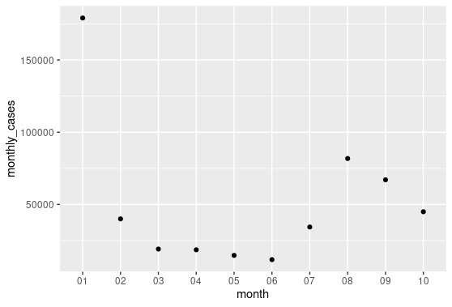

# BE310 Project: Covid-19 Data Analysis

## Repo Contents

- `project.R`: R script used for Covid-19 data analysis
- `covid19_data.csv.zip`: Zipped CSV file containing raw data obtained from the CDC website (https://data.cdc.gov/Case-Surveillance/COVID-19-Case-Surveillance-Public-Use-Data-with-Ge/n8mc-b4w4/data)
- `Total.png`: Graph, obtained using R, showing the total number of cases for January to October of 2021
- `by_race.png`: Graph, obtained using R, showing the total number of cases per race for Janurary to October of 2021
- `LICENSE`: MIT licensing agreement
\
&nbsp;

*Note: Navigate to the appropriate directory and use the following command to uncompress the raw data file*

```
$ unzip covid19_data.csv.zip
```

---

## Project Overview

- **Research Question:** Does race affect the likelihood of an individual being Covid positive? If so, what accompanying factors contribute to this relationship?
- **Significance & Background:** Organizations at all levels (national, state, etc.) have conducted analyses to further understand how this pandemic has affected different populations. Understanding how these populations are affected differently is paramount to our ability to address this pandemic from all angles.

---

## Database Overview 

**The COVID-19 Case Surveillance Database:**
- This data is accessible through the CDC website 
- Patient data was reported by U.S. states and autonomous reporting entities (NYC, DC), as well as U.S. territories and affiliates
- 37,532,072 observations (1,160,745 for AZ) and 19 variables

**Explanatory Variable:** Race
- Categorical
- Non-continuous

**Dependent Variable:** Percentage infected per month
- Quantitative
- Continuous

---

## Hypothesis and Rationale

**I hypothesize that race does affect the likelihood of an individual being Covid positive.**

- Possible underlying genetic/physiological differences
    - Immune responses were found to be varied following rubella vaccination, with individuals of African descent having significantly higher rubella-specific neutralizing antibody levels when compared to other individuals (Haralambieva IH, et al, 2014)
- Variation in vaccination rates
    - Vaccination rates are varied in Arizona, ranging from 47.2% (White) to 3.0% (Black) (AZDHS, 2021)
    - This variation could be attributed to underlying socioeconomic factors (education, job stability, available transportation)and/or cultural differences 

---

## Methods 

R was used to:
- Calculate total number positive cases per month 
- Calculate percentage of positive cases per month, grouped by race
- Determine the race with the highest percent infected for each month

---

## Results and Conclusions 

- Overall, the monthly percentages are consistent with the trends shown in the monthly cases vs. month graph 
- Race is an apparent factor with regard to an individual's likelihood of being Covid positive
    - African Americans with the highest probability, having the highest monthly incidence rate for 6 out of the 10 months
    - Asian Americans with the lowest probability, having the highest monthly incidence rate for 0 out of the 10 months
    - Vaccine rates per race appear to contribute to this relationship
\
&nbsp;




*Total number positive cases per month*


*Percentage of positive cases per month, grouped by race*
     

---

## Future Research Possibilities 

Research can be expanded by looking at the effects of other factors such as: 

- Education level
- Household income 
- Job stability 
- Number of household residents 
- Housing type (Home, apartment, townhouse)
- Trust in medical authority 

---

## References

1. AZDHS: Epidemiology & Disease Control - Mosquito borne Arizona Department of Health Services. Available at: https://www.azdhs.gov/covid19/data/index.php#vaccine-admin [Accessed November 26, 2021]. 
2. Center for Disease Control, Data from “COVID-19 Case Surveillance Database”. Available at https://data.cdc.gov/Case-Surveillance/COVID-19-Case-Surveillance-Public-Use-Data-with-Ge/n8mc-b4w4/data .<https://data.cdc.gov/Case-Surveillance/COVID-19-Case-Surveillance-Public-Use-Data-with-Ge/n8mc-b4w4/data> On April 5, 2020. 
3. Haralambieva IH, et al. (2014) Associations between race, sex and immune response variations to rubella vaccination in two independent cohorts. Vaccine 32(17):1946–1953. 
4. U.S. Census Bureau quickfacts: Arizona; United States Available at: https://www.census.gov/quickfacts/fact/table/AZ,US/PST045219 (2019) [Accessed November 26, 2021]. 

---


